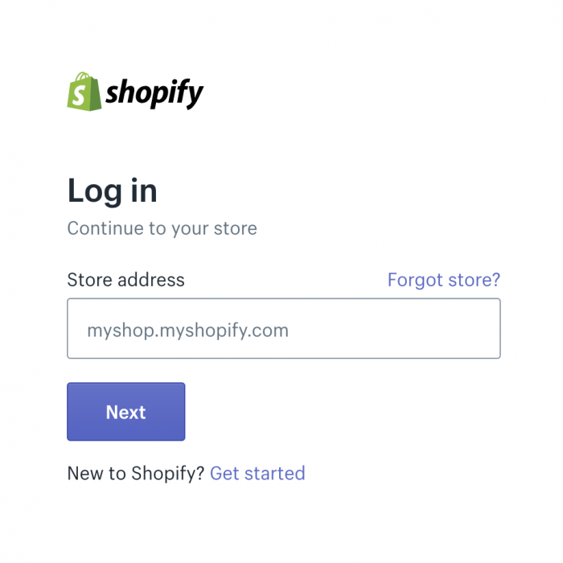
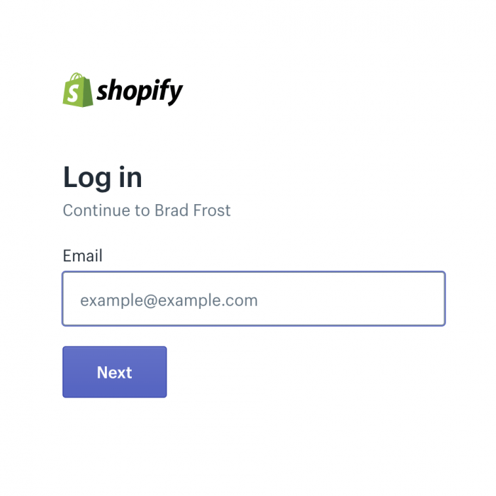
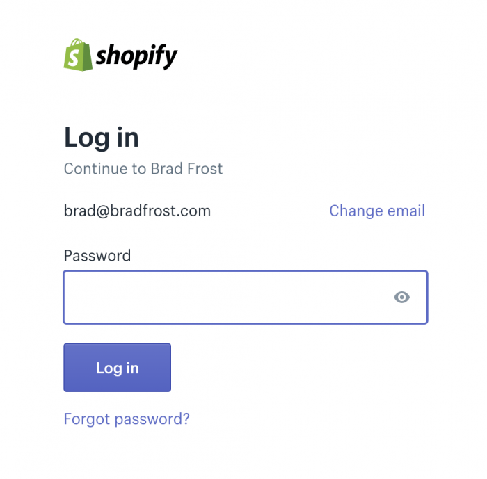
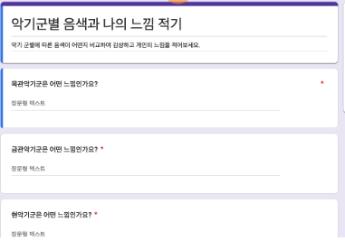

# 🏗️ 컴포넌트 기반 UI 협업 가이드

기획, 디자인, 퍼블리셔, 개발이 각자의 도구로 작업하더라도 화면을 바라보는 관점이 다르면 협업 과정에서 오해와 비효율이 생깁니다. 본 가이드는 네 직군이 UI를 같은 관점, 같은 단위로 바라볼 수 있도록 공통 기준을 제시합니다. 각자의 전문 영역을 넘어 같은 사고방식을 공유할 때 설계, 시안, 마크업, 구현이 하나의 결과물로 자연스럽게 연결됩니다.

1섹션은 컴포넌트를 어떻게 바라볼 것인지 개념을 다룹니다. 2섹션은 그 개념을 퍼블리셔가 BEM으로 어떻게 구현하는지를 보여줍니다. 3섹션부터는 실무에서 자주 마주치는 문제들을 UX 관점에서 살펴봅니다.

---

## 1. 개념

### 💡 핵심 원칙: 자기 완결성

컴포넌트는 외부 환경에 의존하지 않고, **스스로 어떻게 보이고 어떻게 동작할지**를 결정하는 독립적인 단위여야 합니다. 이 가이드의 모든 원칙은 이 핵심에서 출발합니다.

---

### 1-1. 컴포넌트의 기본 속성

모든 UI 요소는 크기에 상관없이 하나의 독립된 단위로 존재합니다.

- 외부 개입 없이 내부 규칙을 스스로 결정합니다.
- 할당된 영역 안에서만 존재하며, 외부 레이아웃을 침범하지 않습니다. (예: 컴포넌트 최상위 노드에 `margin` 사용 지양)

```html
<!-- ❌ 컴포넌트 최상위 노드에 margin 사용 -->
<div class="layout">
  <div class="layout__top">
    <div class="card" style="margin-bottom: 20px;">...</div>
  </div>
  <div class="layout__bottom">
    <div class="card">...</div>
  </div>
</div>

<!-- ✅ 감싸고 있는 레이아웃에서 간격 처리 -->
<div class="layout">
  <div class="layout__top">
    <div class="card">...</div>
  </div>
  <div class="layout__bottom" style="margin-top: 20px;">
    <div class="card">...</div>
  </div>
</div>
```

---

### 1-2. 컴포넌트의 구성 요소

컴포넌트는 내부적으로 **레이아웃**과 **콘텐츠**라는 두 가지 핵심 요소로 구성됩니다.

- 레이아웃은 공간을 구획하고 배치 규칙을 결정하는 뼈대입니다. (Flex, Grid 등)
- 콘텐츠는 공간을 채우는 실질적인 정보(데이터)이며, 다른 컴포넌트가 삽입될 수 있습니다.

이 두 요소의 비중에 따라 컴포넌트의 성격이 나뉩니다.

- **레이아웃형 컴포넌트:** 공간 배치가 주된 역할입니다. 내부 콘텐츠가 바뀌어도 본인은 변하지 않습니다. `section`, `article`, `box`, `wrapper` 같은 것들이 해당됩니다. 일반적으로 하위 컴포넌트를 포함하는 구조로 설계됩니다.
- **콘텐츠형 컴포넌트:** 실질적인 정보를 표현하는 것이 주된 역할입니다. 어디에 놓이든 자신의 내용을 스스로 표현합니다. `product-info`, `like-button`, `review-list` 같은 것들이 해당됩니다.

실무에서는 두 역할을 함께 가지는 경우도 있습니다. 이 분류는 컴포넌트를 설계하고 분리할 때 방향을 잡기 위한 기준으로 활용합니다.

---

### 1-3. 내부 레이아웃 설계

컴포넌트가 컨테이너로서 하위 요소들을 정렬하는 방식입니다.

- 그리드, 플렉스, 여백 등 컴포넌트 성격에 맞는 규칙을 자유롭게 가집니다.
- 독립성 유지를 위해 해당 규칙은 **직계 자식 태그**에만 적용하는 것을 권장합니다. 깊은 중첩까지 영향이 미치면 컴포넌트 간 결합도가 높아져 유지보수가 어려워집니다.

---

### 1-4. 중첩 구조와 느슨한 결합

컴포넌트의 콘텐츠 영역에 다시 컴포넌트가 들어오며 구조가 확장되는 방식입니다.

- 콘텐츠 영역에 새로운 컴포넌트가 삽입되면서 계층 구조가 형성됩니다. 이를 **액자식 구성**이라 합니다.
- 상위 컨테이너는 레이아웃만 제공할 뿐, 내부에 담긴 컴포넌트의 고유 질서나 구현 방식에 영향을 주지 않습니다.

---

### 1-5. 단일 책임 원칙

하나의 컴포넌트는 하나의 역할만 담당해야 합니다. 컴포넌트가 너무 많은 역할을 가지면 재사용이 어려워지고, 한 곳의 변경이 예상치 못한 다른 곳에 영향을 줄 수 있습니다.

- 컴포넌트가 복잡해지고 있다면 역할이 여러 개로 늘어난 신호입니다. 이때는 더 작은 단위로 분리하는 것을 검토합니다.
- 분리할 때는 1-2에서 다룬 유형을 기준으로 삼습니다. 레이아웃 역할과 콘텐츠 역할을 구분해서 각자의 책임에 맞게 쪼개는 것이 방향입니다.
- 이 원칙은 느슨한 결합 원칙과 연결됩니다. 각 컴포넌트가 단일 역할만 가질수록 조합과 교체가 자유로워집니다.

이 원칙이 지켜지지 않으면 **God Component**가 됩니다. 자세한 내용은 1-6을 참조합니다.

---

### 1-6. God Component

하나의 컴포넌트가 모든 것을 처리하는 상태를 God Component라 합니다. 처음에는 편리해 보이지만 기능이 추가될수록 조건 분기가 쌓이고, 어느 순간 누구도 전체 구조를 파악하기 어려운 상태가 됩니다. 디버그도, 수정도, 재사용도 어려워집니다.

코드 레벨에서 God Component는 Modifier 과잉으로 나타나는 경우가 많습니다. 자세한 내용은 2-7을 참조합니다.

---

### 1-7. 컴포넌트 유일성과 판단 기준

**"하나의 컴포넌트, 하나의 정체성"**을 원칙으로 합니다. 무엇을 같은 컴포넌트로 묶을지는 아래 기준을 바탕으로 협의합니다.

#### ✅ 기준 1. 논리적 동일성

- 데이터의 본질이 같은 경우
- 예시: '상품 정보'라는 데이터가 같다면, 가격 표시 여부나 세부 항목이 다르더라도 하나의 '상품' 컴포넌트 안에서 관리합니다.

#### ✅ 기준 2. 시각적 동일성

- 데이터는 다르지만 겉모습과 배치 규칙이 같은 경우
- 예시: '공지사항'과 '이벤트'는 데이터 성격이 다르지만, 리스트 UI 모양이 같다면 하나의 UI 틀을 공유합니다.

#### ⚠️ 분리 및 협의

- 위 기준에도 불구하고 형태가 너무 달라 관리가 복잡하다면 과감히 분리합니다. (예: PC와 Mobile의 UI 구조가 완전히 다른 경우 이름을 다르게 명명)
- 데이터의 본질이 같더라도 조건에 따라 표현 방식이 지나치게 달라진다면 분리를 검토합니다. 데이터가 같다는 이유만으로 하나의 컴포넌트로 유지하는 것이 항상 옳지는 않습니다.
- 기획·디자인·개발의 관점이 다를 수 있으므로, 프로젝트 효율성을 고려해 최종 분리 여부는 직군 간 협의로 결정합니다.

💡 어디까지를 하나의 컴포넌트로 볼 것인지, 언제 분리할 것인지는 명확한 정답이 없습니다. 위의 기준들은 판단을 돕기 위한 가이드일 뿐이며, 실제로는 프로젝트 규모, 팀의 컨벤션, 그리고 경험에서 쌓인 직관이 함께 작용합니다. 중요한 것은 기준을 공유하고 직군 간 협의를 통해 일관성을 유지하는 것입니다.

아래는 분리를 검토할 때 참고할 수 있는 질문들입니다.

- 이 컴포넌트에 명확한 이름을 한 마디로 붙이기 어렵지 않은가?
- 조건 분기가 점점 늘어나고 있지 않은가?
- 다른 곳에서 재사용할 때 불필요한 부분까지 함께 따라오지 않는가?
- 한 사람이 이 컴포넌트 전체를 한눈에 파악할 수 있는가?

---

## 2. BEM 명명 규칙으로 보는 컴포넌트 구조

앞서 설명한 개념이 실제 코드에서 어떻게 표현되는지 BEM 명명 규칙을 통해 확인할 수 있습니다. BEM은 Block, Element, Modifier의 약자로, 클래스 이름만으로 컴포넌트의 구조를 파악할 수 있게 해주는 명명 규칙입니다.

- Block(`card`)은 하나의 독립된 컴포넌트를 의미합니다.
- Element(`card__thumbnail`, `card__title`)는 해당 컴포넌트에 종속된 자식 요소입니다.

### 2-1. 컴포넌트 중첩 구조

```html
<div class="card">
  <div class="card__thumbnail"></div>
  <div class="card__title"></div>
  <div class="card__footer"></div>
</div>
```

이때 `card__` 접두어가 붙지 않은 새로운 이름이 등장하면, 그것은 `card` 컴포넌트의 자식이 아니라 **별개의 컴포넌트가 내부에 삽입된 것**으로 이해해야 합니다.

```html
<div class="card">
  <div class="card__thumbnail"></div>
  <div class="card__title"></div>
  <div class="card__footer">
    <div class="banner">  <!-- card의 자식이 아닌, banner라는 독립 컴포넌트 -->
      <div class="banner__header"></div>
      <div class="banner__body"></div>
    </div>
  </div>
</div>
```

`banner`는 `card` 안에 위치하지만 `card__`로 이어지지 않습니다. `card`는 자리를 내어줄 뿐이고, `banner`는 자신의 규칙대로 독립적으로 존재합니다. 이것이 앞서 설명한 느슨한 결합이 실제 코드에서 표현되는 방식입니다.

한편 아래처럼 두 클래스를 하나의 태그에 함께 쓰는 경우도 있습니다.

```html
<div class="card__footer banner">...</div>
```

이 표현은 해당 태그가 `card`의 자식이면서 동시에 `banner` 컴포넌트임을 의미합니다. 구조를 간결하게 표현할 수 있다는 장점이 있지만, `card__footer`와 `.banner`의 CSS 프로퍼티가 같은 태그에 적용되면서 스타일 충돌이 발생할 수 있습니다. 가급적 지양하고, 컴포넌트는 별도의 태그로 분리하는 것을 권장합니다.

### 2-2. CSS 구조

CSS도 같은 원칙을 따릅니다. 각 컴포넌트는 자신의 Block 이름을 기준으로 스타일을 완전히 독립적으로 가집니다.

```css
/* card 컴포넌트 */
.card { ... }
.card__thumbnail { ... }
.card__title { ... }
.card__footer { ... }

/* banner 컴포넌트 */
.banner { ... }
.banner__header { ... }
.banner__body { ... }
```

`card` 안에 `banner`가 들어가 있더라도 `.card` 스타일이 `.banner`에 영향을 주지 않습니다. 위치 조정이 필요하다면 `card__footer` 안에서 처리하고, `banner` 자체는 건드리지 않습니다.

```css
/* ✅ card__footer가 내부 배치만 담당 */
.card__footer { display: flex; align-items: center; }

/* ❌ card가 banner 내부를 침범 */
.card__footer .banner { margin-left: 8px; }
```

이렇게 컴포넌트 경계를 CSS에서도 지키면, `banner`를 다른 곳에 가져다 써도 스타일이 깨지지 않습니다.

### 2-3. 액자식 구성

이 구조는 반대로도 성립합니다. 아래는 `card` 안에 `banner`가 들어오고, 그 `banner__body` 안에 다시 `card`가 들어오는 구조입니다.

```html
<div class="card">
  <div class="card__thumbnail"></div>
  <div class="card__title"></div>
  <div class="card__footer">
    <div class="banner">
      <div class="banner__header"></div>
      <div class="banner__body">
        <div class="card">
          <div class="card__thumbnail"></div>
          <div class="card__title"></div>
          <div class="card__footer"></div>
        </div>
      </div>
    </div>
  </div>
</div>
```

어느 쪽이 상위든 하위든 각 컴포넌트는 자신의 규칙대로 존재하고, 상위 컨테이너는 자리만 내어줄 뿐입니다. 이것이 액자 안에 액자가 들어가는 구조, 즉 액자식 구성입니다.

---

### 2-4. BEM 클래스명 해석 방법

```html
<div class="card">
  <div class="card__title"></div>  <!-- card에 종속된 요소 -->
  <div class="card-title"></div>   <!-- card 안에 삽입된 별도 컴포넌트 -->
</div>
```

`card__title`은 `card`에 종속된 Element입니다. 반면 `card-title`처럼 `__`가 없으면 `card`와 무관한 독립 컴포넌트로 해석해야 합니다. 같은 `card` 안에 위치하더라도 느슨한 결합으로 삽입된 별개의 컴포넌트입니다.

`card__title`은 `card` 없이는 존재할 수 없습니다. 아래처럼 단독으로 사용하는 것은 BEM 원칙에 어긋나며, 독립적으로 사용이 필요하다면 별도의 컴포넌트로 분리해야 합니다.

```html
<body>
  <div class="card__title"></div>  <!-- ❌ card 없이 단독 사용 불가 -->
</body>
```

### 2-5. 상위 컴포넌트의 종속 요소가 하위 컴포넌트 안에 들어가는 경우

```html
<div class="card">
  <div class="card__footer">
    <div class="banner">
      <div class="card__text"></div>  <!-- card의 종속 요소가 banner 안에 위치 -->
    </div>
  </div>
</div>
```

개념적으로 틀리지는 않습니다. `card__text`는 여전히 `card`에 종속된 요소입니다. 다만 `banner` 컴포넌트를 다른 곳에 복제하거나 재사용할 때, `card__text`가 `banner`의 구성원인지 `card`에서 내려온 요소인지 팀원 간 인식이 엇갈릴 수 있습니다. 컴포넌트 구조에 대한 이해가 일치하지 않으면 코드가 뒤섞일 위험이 있으므로, 이런 구조는 사용을 자제하는 것을 권장합니다.

---

### 2-6. Modifier

Modifier(`--`)는 컴포넌트 또는 하위 요소의 변형을 표현하는 수단입니다. 단독으로 사용할 수 없으며, 반드시 원래 Block 또는 Element 클래스와 함께 사용해야 합니다.

```html
<!-- ❌ Modifier 단독 사용 -->
<div class="card__thumbnail--type01">...</div>

<!-- ✅ 원래 클래스와 함께 사용 -->
<div class="card__thumbnail card__thumbnail--type01">...</div>
```

다만 Modifier가 3개 이상 붙으면 클래스가 길어져 가독성이 떨어집니다.

```html
<div class="card__thumbnail card__thumbnail--type01 card__thumbnail--size-large card__thumbnail--dark">...</div>
```

이 문제에 대해 실무에서는 팀 내 협의를 통해 아래 절충안 중 하나를 선택하기도 합니다.

- **Block 레벨로 올리기:** 여러 하위 요소가 동시에 같은 방식으로 변형된다면 Block에 Modifier 하나를 붙이고 CSS에서 하위 요소를 조정합니다.

```html
<div class="card card--dark">
  <div class="card__thumbnail">...</div>
  <div class="card__title">...</div>
</div>
```

```css
.card--dark .card__thumbnail { ... }
.card--dark .card__title { ... }
```

- **단일 대시 `-` 사용 (ABEM 방식):** ABEM이라는 BEM 변형 방법론에서 제안하는 방식으로, Modifier를 별도 클래스로 분리하고 앞에 `-`를 붙입니다. BEM 원칙에서 벗어나지만 가독성이 좋아집니다.

```html
<div class="card__thumbnail -type01 -size-large -dark">...</div>
```

어떤 방식을 선택하든 프로젝트 내에서 일관되게 적용하는 것이 중요합니다.

---

### 2-7. Modifier 과잉과 컴포넌트 분리

요구사항이 늘어날수록 Modifier가 계속 추가되는 경우가 있습니다. 아래는 간단한 예시입니다.

```js
element.classList.toggle('card--dark', isDark);
element.classList.toggle('card--bordered', isBordered);
element.classList.toggle('card--size-large', isLarge);
```

이런 조건 분기가 늘어날수록 하나의 컴포넌트에 Modifier가 계속 쌓입니다.

```html
<div class="card card--type-a card--size-small card--theme-dark card--bordered card--rounded card--shadow ...">
```

Modifier가 지나치게 많아진다면 그것은 사실상 여러 개의 다른 컴포넌트를 하나로 억지로 묶어놓은 상태입니다. 이는 1-6에서 다룬 God Component와 같은 문제로 이어집니다. 조건 분기가 쌓이고 어떤 조합이 유효한지 파악하기 어려워지며, 한 곳의 수정이 다른 변형에 영향을 줄 수 있습니다. 컴포넌트 분리를 검토할 타이밍입니다.

같은 문제는 Modifier가 아닌 콘텐츠 구성에서도 나타납니다. 같은 데이터를 사용하더라도 조건에 따라 표현 방식이 지나치게 달라진다면, 1-7의 분리 및 협의 기준에 따라 분리를 검토합니다.

```js
if (type === 'price') {
  // 가격 표시
} else if (type === 'stock') {
  // 재고 상태 표시
} else if (type === 'delivery') {
  // 배송 정보 표시
}
```

```html
<div class="product-info">
  <!-- type === 'price' -->
  <span class="product-info__price">19,900원</span>

  <!-- type === 'stock' -->
  <span class="product-info__stock">재고 3개 남음</span>

  <!-- type === 'delivery' -->
  <span class="product-info__delivery">내일 도착 예정</span>
</div>
```

이런 분기가 늘어날수록 컴포넌트의 정체성이 흐려집니다. 1-7의 판단 기준을 다시 적용해서 분리 여부를 점검하고, 필요하다면 `product-price`, `product-stock`, `product-delivery`처럼 분리하는 것을 검토합니다.

---

## 3. 실무 컴포넌트의 문제와 UX

좋은 디자인은 사용성 위에 세워집니다. 그러나 실무에서는 종종 반대의 일이 일어납니다. 시각적으로 화려하거나 움직이면 좋은 디자인이라고 느끼는 경향이 있기 때문입니다. 이를 **Aesthetic-Usability Effect**라고 합니다.

**🔍 Aesthetic-Usability Effect란?**

시각적으로 매력적인 디자인을 보면 사람들은 실제 사용성과 무관하게 그것이 더 잘 작동할 것이라고 믿습니다. 그러나 이 효과는 첫인상에서만 작동합니다. 쓰면 쓸수록 불편함은 쌓이고, 결국 사용자는 외면하게 됩니다. 사용성을 희생해서 얻은 시각적 효과는 좋은 디자인이 아닙니다.

감각적인 디자인을 사용성 있게 화면에 녹이려면 충분한 논의와 고민이 필요합니다. 그런데 실무에서는 이런 과정 없이 방향을 밀어붙이는 경우가 종종 있습니다. 이러한 과정을 생략하고도 훌륭한 결과가 나오는 경우는 보통 두 가지입니다. 설계자의 감각이 천재적이거나, 아니면 자신의 결과물이 훌륭하다고 믿는 독불장군이거나. 하지만 천재는 그리 많지 않습니다.

아래에서는 실무에서 자주 잘못 쓰이는 대표적인 사례들을 살펴봅니다.

---

### 3-1. 애니메이션과 인터랙션 UX

애니메이션은 UI를 더 직관적으로 만드는 강력한 도구입니다. 특히 이런 경우에 효과적입니다.

- 버튼 클릭, 토글 전환 같은 **마이크로인터랙션 피드백**
- 화면 전환 시 **공간적 맥락 전달** ("이 화면이 저 화면에서 열렸다")
- 로딩, 저장 같은 **시스템 상태 표시**

잘 쓰인 애니메이션은 사용자가 의식하지 못할 만큼 자연스럽습니다. 방금 무슨 일이 일어났는지, 무언가가 어디로 갔는지를 알려주면서 조용히 자기 역할을 합니다.

반면 잘못 쓰인 애니메이션은 정보 제공을 늦춥니다.

사용자는 원하는 정보를 찾거나 행동을 취하러 왔습니다. 그 과정에서 애니메이션이 끼어들면 이런 문제가 생깁니다.

- 콘텐츠가 뒤늦게 등장해 사용자가 기다려야 합니다.
- 버튼이 아직 나타나지 않아 행동할 수 없습니다.
- 텍스트가 천천히 펼쳐지면 읽는 흐름이 끊깁니다.

NN/G는 이를 "사용자가 페이지가 텍스트를 로딩하는 것처럼 느끼게 만들어 강제로 기다리게 한다"고 표현합니다. 콘텐츠가 스스로 움직이기 시작하는 순간, 사용자는 인지적으로 더 많은 부담을 느끼고 정작 중요한 정보를 놓치기 쉬워집니다.

> 📎 **NN/G(Nielsen Norman Group)** 는 Jakob Nielsen과 Don Norman이 설립한 UX 리서치 전문 기관입니다. 실제 사용자 테스트를 기반으로 한 연구로 업계에서 신뢰도 높은 출처로 인정받고 있습니다.

아래 내용은 이 관점에서 실무에서 마주치는 구체적인 문제들을 다룹니다.

---

#### 뷰포트 밖 CSS 애니메이션은 멈추지 않는다

CSS 애니메이션은 뷰포트 밖에 있어도 브라우저가 자동으로 멈추지 않습니다. 사용자가 보지 않는 영역에서도 애니메이션이 계속 실행되고 있습니다. 스크롤을 내렸다 올라왔을 때 애니메이션이 이미 끝나있거나 중간 상태인 경우가 이 때문입니다. 제어가 필요하다면 IntersectionObserver로 직접 처리해야 합니다.

```js
const observer = new IntersectionObserver((entries) => {
  entries.forEach(entry => {
    entry.target.style.animationPlayState = entry.isIntersecting ? 'running' : 'paused';
  });
});
```

#### 🖼️ 이미지 Lazy Loading

같은 맥락에서 이미지 Lazy Loading도 생각해볼 필요가 있습니다. 이미지는 기본적으로 페이지 로드 시 뷰포트 밖에 있는 것까지 전부 불러옵니다. `loading="lazy"` 속성을 사용하면 뷰포트에 진입할 때까지 로딩을 미룰 수 있습니다.

```html

```

⚠️ 위 두 방법 모두 성능 최적화나 훌륭한 제어 방법처럼 보이지만 좋은 UX가 아닙니다. 사용자가 스크롤해서 해당 영역에 도달하는 순간 그제서야 콘텐츠가 로딩되거나 애니메이션이 시작되고, 콘텐츠가 뒤늦게 나타나거나 레이아웃이 흔들리는 경험을 줍니다.

---

#### display: none 과 CSS 애니메이션

`display: none` 상태의 요소는 렌더 트리에서 완전히 제외됩니다. 렌더 트리는 실제로 화면에 그려지는 요소들로만 구성되기 때문에, `display: none`인 요소는 브라우저 입장에서 존재하지 않는 것과 같습니다. 따라서 CSS 애니메이션이 걸려 있어도 실행되지 않으며, `display: block`으로 전환되는 순간 애니메이션이 처음부터 시작됩니다.

```css
/* display: none 상태에서는 애니메이션이 진행되지 않음 */
.tab-panel { display: none; animation: fadeIn 0.3s; }
.tab-panel.is-active { display: block; } /* 이 순간 애니메이션 리셋 */
```

⚠️ 탭이나 토글로 show/hide 되는 영역 안에 애니메이션 요소가 있을 때 사용자마다 경험이 달라집니다. 탭 A가 활성화 상태일 때 애니메이션 요소가 화면 하단에 있어 못 봤다면, 탭 B를 거쳐 탭 A로 돌아오는 순간 `display: none`이 해제되며 애니메이션이 처음부터 재시작됩니다. 같은 컴포넌트인데 어떤 사용자는 보고 어떤 사용자는 못 보는 경험의 불일치가 생깁니다.

빠르게 탭을 반복 전환하면 애니메이션이 완료되지 않은 채 쌓여 동작 자체가 꼬이는 기술적 문제도 발생합니다.

탭이나 토글 등으로 숨겨지는 영역 안에는 애니메이션을 넣지 않는 것을 권장합니다.

---

#### 스크롤 중 애니메이션 트리거의 문제

사용자는 콘텐츠가 늦게 뜨는 이유를 구분하지 않습니다. 서버가 느린 것이든, 애니메이션 때문인 것이든 결과는 같습니다. "이 사이트 느리다"는 인상만 남습니다. 스크롤 진입 시 애니메이션을 트리거하는 방식은 실무에서 자주 쓰이지만 아래와 같은 문제가 있습니다.

- **정보 전달 지연:** 텍스트, 가격, 안내 문구 같은 정보성 콘텐츠가 fade in이나 slide up으로 등장하면 사용자는 즉시 정보를 얻지 못합니다.
- **스크롤 흐름 방해:** 빠르게 스크롤하는 사용자는 애니메이션이 끝나기도 전에 지나쳐버립니다. NN/G 연구에 따르면 500ms를 넘는 스크롤 애니메이션은 사용자가 지나쳐버리는 경우가 많습니다.

장식성 콘텐츠라도 마찬가지입니다. 스크롤 중 갑자기 등장하는 애니메이션은 사용자의 시선을 강제로 잡아끌어 흐름을 끊습니다. 각각의 애니메이션이 주는 지연은 미미해 보여도 여러 개가 쌓이면 점점 눈에 띄게 됩니다. 움직임이 많으면 역동적이고 세련돼 보인다고 착각하기 쉽습니다. 하지만 사용자는 그 움직임에 감동받는 게 아니라 피로를 느낍니다. 남용이 반복되면 결국 움직임 자체를 광고처럼 무시하게 됩니다. 이를 **배너 맹목성(Banner Blindness)** 이라고 합니다.

> 📎 **배너 맹목성(Banner Blindness)** 은 1998년 Benway & Lane의 연구에서 처음 제시된 개념으로, 사용자가 광고처럼 보이는 요소를 무의식적으로 무시하게 되는 현상입니다. 반복적인 움직임과 시각적 노이즈에도 동일하게 적용됩니다.

특히 금융 서비스처럼 목적이 명확한 사용자일수록 이 문제는 더 두드러집니다. NN/G는 의료, 금융 같은 고관여 서비스의 사용자는 "멋진 디자인에 감동받고 싶은 게 아니라 답을 빨리 얻고 싶은" 사람들이라고 설명합니다. 이런 환경에서 뚜렷한 목적성 없는 과도한 애니메이션 사용은 브랜드 인상이 아니라 불편함으로 작용할 가능성이 높습니다.

---

#### 애니메이션과 접근성

애니메이션을 과도하게 사용하면 단순히 UX가 나빠지는 것을 넘어 일부 사용자에게 실제 신체적 불편함이나 위험을 줄 수 있습니다.

**움직임 민감성** — 전정계 장애나 어지럼증이 있는 사용자에게 과도한 모션은 메스꺼움과 현기증을 유발합니다. 40세 이상 성인의 약 35%가 움직임 민감성을 가지고 있습니다. OS의 "움직임 줄이기" 설정을 켠 사용자에게는 `prefers-reduced-motion`으로 대응할 수 있습니다.

```css
/* CSS — prefers-reduced-motion 감지 */
@media (prefers-reduced-motion: reduce) {
  * {
    animation: none !important;
    transition: none !important;
  }
}
```

```js
// JS — Lottie, GSAP 등 JS 기반 애니메이션 제어
const prefersReduced = window.matchMedia('(prefers-reduced-motion: reduce)').matches;

if (prefersReduced) {
  lottieInstance.stop(); // Lottie 정지
}
```

**광과민성 발작** — 1초에 3회 이상 번쩍이는 콘텐츠는 광과민성 간질 환자에게 발작을 유발할 수 있습니다. WCAG 2.3.1에서 명시적으로 금지하는 기준이며, 사용자 설정과 무관하게 누구에게나 발생할 수 있어 더 주의가 필요합니다.

> 📎 **포켓몬 쇼크(1997)** — 1997년 12월 일본에서 포켓몬스터 애니메이션 38화 방영 중 피카츄의 전기 공격 장면에서 빨간색과 파란색이 빠르게 점멸하는 화면 효과로 인해 시청하던 아동 750명이 광과민성 발작을 일으킨 사건입니다. 기네스북에 "가장 많은 사람들에게 발작을 일으킨 TV 프로그램"으로 등재됐으며, 이 사건이 WCAG의 점멸 콘텐츠 금지 기준이 마련되는 계기 중 하나가 됐습니다.

---

#### 애니메이션은 Above the Fold에서 가장 효과적이다

NN/G 연구에서 웹 사용자는 페이지 체류 시간의 80%를 Above the Fold, 즉 최초 진입 시 보이는 영역에서 보냅니다. 애니메이션이 가장 효과적으로 동작하는 구간도 여기입니다.

- 페이지 로드와 동시에 렌더링된 상태에서 시작되므로 의도대로 동작합니다.
- 스크롤 없이 바로 보이므로 사용자가 놓치지 않습니다.
- 브랜딩, 첫인상, 주목도를 높이는 용도로 가장 적합합니다.

Below the Fold로 내려갈수록 애니메이션의 효과는 줄고 문제는 늘어납니다.

| 영역 | 정보성 콘텐츠 | 장식성 콘텐츠 |
|---|---|---|
| Above the Fold | ✅ 자유롭게 사용 | ✅ 자유롭게 사용 |
| Below the Fold | ❌ 즉시 노출 권장 | ⚠️ 최소화 권장 |

💡 애니메이션을 추가하기 전에 먼저 물어보세요. "이 시점에서 사용자가 무엇을 이해하거나 해야 하는가?" 답이 "그냥 멋있어 보이려고"라면 다시 생각해야 합니다. 좋은 애니메이션은 눈에 띄지 않습니다. 사용자가 의식하지 못하는 사이에 인터페이스를 더 자연스럽게 느끼게 하는 것, 그것이 목표입니다.

---

### 3-2. 입력 폼과 멀티스텝 UX

입력 폼은 사용자에게 가장 많은 인지적 부담을 주는 UI 요소 중 하나입니다. 이름, 연락처, 결제 정보, 배송지 등 요구하는 항목이 많아질수록 사용자는 전체 분량을 보는 순간부터 압박을 느끼고 이탈할 가능성이 높아집니다.

이 문제를 해결하기 위해 등장한 것이 **멀티스텝 폼**입니다. 긴 폼을 논리적인 단위로 나눠 한 번에 하나씩 처리하게 함으로써 인지적 부담을 낮추는 방식입니다. 대표적인 구현 방식은 두 가지입니다.

- **페이지 분리형** — 단계마다 페이지가 전환되며 상단에 프로그레스바로 현재 위치를 표시합니다.
- **인라인 전환형** — 같은 화면 안에서 애니메이션으로 다음 항목이 등장합니다.

효과는 실제 데이터로도 입증됩니다. 제대로 구조화된 멀티스텝 폼은 단일 페이지 폼 대비 완료율이 최대 86% 높다는 연구 결과가 있습니다. 여기에는 **Endowed Progress Effect(인다우드 프로그레스 이펙트)** 가 작용합니다. 진행 중이라는 느낌이 끝까지 완료하려는 동기를 강화시키는 심리 효과입니다. 멀티스텝 폼이 단순히 화면을 나눈 것이 아니라, 사용자의 심리를 설계에 반영한 결과입니다.

> 📎 **Endowed Progress Effect 예시** — 빈 스탬프 10개짜리 카드보다 스탬프 2개가 미리 찍혀있는 12개짜리 카드의 완료율이 더 높았다는 연구가 있습니다. 실제로는 더 많은 스탬프가 필요함에도 "이미 시작됐다"는 느낌이 완료 동기를 높인 것입니다.

#### ⚠️ 멀티스텝의 남용

멀티스텝 폼의 효과가 알려지면서 필요하지 않은 곳에도 적용하는 경우가 늘었습니다. 짧고 단순한 폼을 억지로 나누면 오히려 역효과가 납니다.

한 화면에 항목을 모두 보여주면 사용자는 "이름, 연락처, 사이즈, 주소 입력하면 되겠구나"를 한 번에 파악하고 머릿속에서 미리 준비할 수 있습니다. 반면 하나씩 나오면 매 단계마다 "또 뭐가 나오지?"를 반복해야 합니다. 인지 부담이 분산되는 게 아니라 오히려 매 단계마다 새로 적응해야 하는 것입니다. 불필요한 클릭과 대기도 생깁니다.

항목이 3~5개 수준의 단순한 폼이라면 멀티스텝은 편리함이 아니라 불필요한 마찰을 만들 뿐입니다.

#### 기술적 이유 없이 따라하는 경우

로그인 화면에서 아이디를 입력하고 다음을 누르면 그제서야 비밀번호 입력란이 나오는 방식을 자주 볼 수 있습니다. 구글이나 마이크로소프트 같은 서비스는 이유가 있습니다. 아이디를 먼저 확인해서 일반 계정인지, 기업 SSO 계정인지에 따라 다른 인증 흐름으로 분기해야 하기 때문입니다.

아이디/비밀번호 로그인만 있는 일반 서비스가 이 패턴을 쓰는 건 기술적 이유가 없습니다. 사용자 입장에서는 한 화면에서 끝낼 수 있는 것에 불필요한 클릭과 대기가 추가된 것뿐입니다. UX 설계자 Brad Frost는 Shopify가 스토어 주소 → 이메일 → 비밀번호를 3개 화면으로 나눈 것에 대해 "본질적으로 3개 필드짜리 폼인데 사용자가 불필요하게 3개 화면을 헤쳐나가야 한다"고 직접 비판했습니다. 또한 크롬 자동완성이나 1Password 같은 비밀번호 매니저는 아이디와 비밀번호를 한 번에 채워주는데, 화면이 나뉘어 있으면 현재 화면의 필드만 채우고 멈춥니다. 다음 화면의 비밀번호는 직접 입력해야 하는 불편함이 생깁니다. ([Don't Get Clever with Login Forms](https://bradfrost.com/blog/post/dont-get-clever-with-login-forms/))

**Shopify 로그인 화면 — 3단계로 나뉜 구조**

| 1단계 | 2단계 | 3단계 |
|---|---|---|
|  |  |  |

반면 구글 폼은 모든 항목을 한 화면에 보여줍니다. 항목이 많지 않은 경우 사용자가 전체 흐름을 한 번에 파악할 수 있어 더 빠르고 직관적입니다.

**Google Forms — 모든 항목을 한 화면에 표시**



디자인한 입력 폼이 구글 폼에 준하는 사용성을 제공하지 못한다면, 그것은 디자인이 사용성 위에 있다는 신호입니다. 디자인은 사용성을 돋보이게 하는 도구여야지, 사용성을 저해하는 수단이 되어서는 안 됩니다. 이것이 UX적으로 올바른 디자인이 어려운 이유이고, 충분한 고민과 논의가 필요한 이유입니다.


---

### 3-3. 탭 컴포넌트의 구조적 문제

탭은 활성 탭 하나를 제외한 나머지를 숨기는 구조입니다. 화면을 깔끔하게 정리할 수 있다는 장점이 있지만, 이 구조 자체가 여러 문제를 만들어냅니다.

#### 콘텐츠 발견성 문제

Baymard Institute의 대규모 이커머스 사이트 사용성 테스트에 따르면 수평 탭 레이아웃에서 평균 27%의 사용자가 탭 안에 숨겨진 콘텐츠를 아예 발견하지 못했습니다. 탭이 있다는 것 자체를 모르고 지나치는 겁니다. 놓친 콘텐츠가 리뷰, 스펙, 배송 정보처럼 구매 결정에 중요한 정보라면 사용자는 정보가 없다고 판단하고 이탈합니다.

> 📎 **Baymard Institute** 는 이커머스 UX에 특화된 덴마크의 독립 리서치 기관입니다. 실제 사용자 테스트를 수천 건씩 진행해 데이터 기반의 가이드라인을 제공하며, NN/G와 함께 업계에서 신뢰도 높은 출처로 인정받고 있습니다.

#### 탭 패널 높이 차이로 인한 레이아웃 이동

탭마다 콘텐츠 양이 다르면 패널 높이가 제각각입니다. 탭을 전환할 때마다 아래 요소들이 위아래로 밀리는 레이아웃 이동(CLS)이 발생합니다. 클릭하려던 버튼이 순간 다른 위치로 이동하면서 의도치 않은 곳을 누르게 되는 문제도 생깁니다.

특히 탭을 콘텐츠 하단에 배치하면 더 위험합니다. 패널 높이가 바뀔 때마다 탭 자체의 위치가 올라갔다 내려갔다 하기 때문입니다. 사용자가 탭을 누르려고 손가락을 가져갔는데 탭이 이미 다른 위치로 이동해 있어 엉뚱한 곳을 누르게 됩니다. 데스크탑 마우스보다 모바일 터치에서 훨씬 치명적입니다.

> 📎 **CLS(Cumulative Layout Shift)** 는 Google이 정의한 Core Web Vitals 지표 중 하나로, 페이지에서 예상치 못하게 레이아웃이 이동하는 정도를 측정합니다. 점수가 낮을수록 안정적인 페이지이며, 0.1 이하가 좋음, 0.25 초과는 나쁨으로 분류됩니다. UX 지표이자 Google 검색 순위에도 반영되는 성능 지표입니다.

이를 해결하기 위한 방법들(min-height 고정, JS 동적 높이 계산, max-height 트릭 등)이 있지만 모두 완벽하지 않습니다. min-height를 고정하면 짧은 패널에서 빈 공간이 생기고, JS로 동적 계산하면 전환 시 여전히 높이가 바뀝니다.

#### 콘텐츠 비교가 불가능한 구조

NN/G는 "사용자가 서로 다른 탭의 정보를 동시에 봐야 하는 경우라면 탭을 쓰지 말라"고 명시합니다. 탭을 오가며 비교해야 하는 상황에서는 단기 기억에 부담을 주고, 탭을 전환할 때마다 추가적인 클릭과 인지적 노력이 필요해 모든 내용을 한 페이지에 펼쳐두는 것보다 사용성이 낮아집니다.

**탭을 쓰기 전에 확인할 것들**

- 탭 안에 들어갈 콘텐츠가 사용자의 목적 달성에 중요한가? 중요하다면 펼쳐서 보여주는 구조를 먼저 고려합니다.
- 사용자가 탭 간 내용을 비교하거나 오가며 참조해야 하는가? 그렇다면 스크롤 구조가 낫습니다.
- 탭마다 콘텐츠 양이 크게 다른가? 레이아웃 이동 문제를 감수할 수 있는지 확인합니다.
- 탭은 콘텐츠 상단에 배치했는가? 하단 배치는 레이아웃 이동 시 터치 오작동으로 이어질 수 있습니다.
- 탭이 없어도 되는 상황인가? 탭은 공간을 아끼기 위한 도구입니다. 공간이 충분하다면 굳이 쓸 필요가 없습니다.
